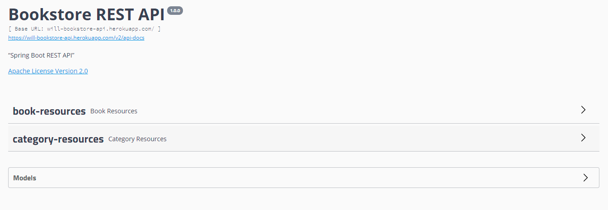

# Bookstore API

> API criada com o intuito de aprimorar minhas habilidades no desenvolvimento back-end com Java + SpringBoot.
### Ajustes e melhorias

O projeto ainda está em desenvolvimento e as próximas atualizações serão voltadas nas seguintes tarefas:

- [x] Criar uma API para gerenciamento de livros de um bibblioteca
- [x] Projeto utilizadando uma estrutura DDD
- [x] Implementar classes de dominio
- [x] Implementar classes restcontoller em resources.
- [x] Implementer uma inteface que extende o JpaRepository
- [x] Implementar classes de service
- [x] Implementar tratamento personalizado de exceções
- [x] Documentar a api com Swagger 2
- [x] Deploy da API no Heroku

## 📝 Diversos

Repositorios Auxiliares

[⬆ Voltar ao topo](#Bookstore-API) 
